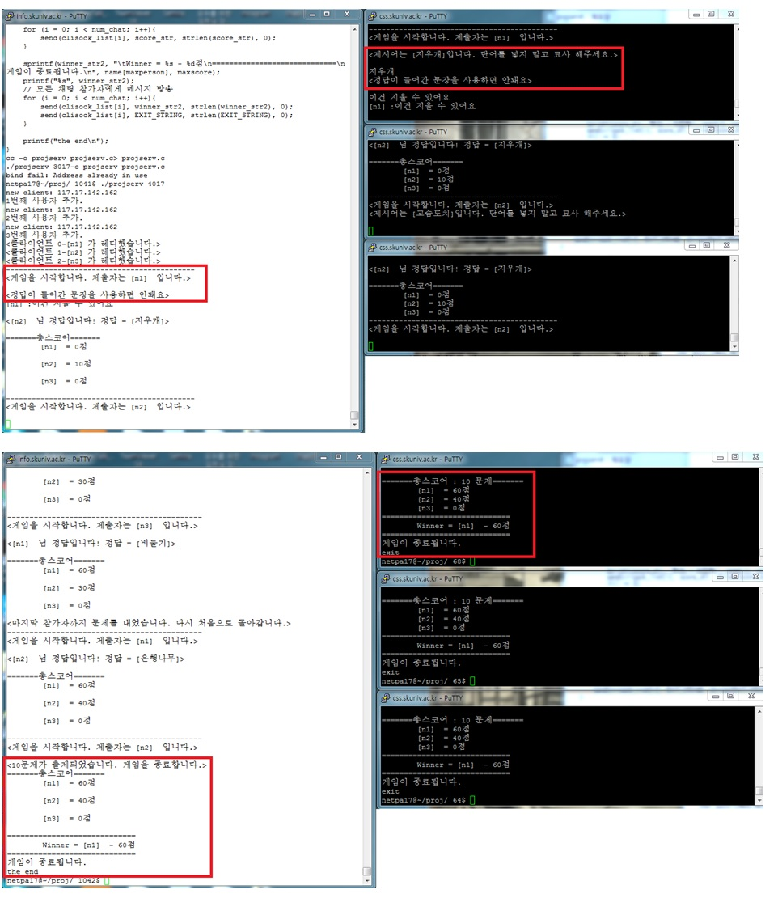

# DescriptionQuiz2018

# 기간
    1개월 (2018-11-20 ~ 2018-12-28)
    
    
# 개요
    리눅스에서의 TCP/IP 소켓을 사용한 서버와의 통신에 대한 이해도를 높이기 위한 프로젝트입니다.
    서버에서 주어진 문제를 출제자가 묘사하고, 참가자가 맞추는 게임을 구현하고자 합니다.
    
    
# 사용한 라이브러리 및 구현 환경
    1. 구현 환경
        - LINUX
        - C language
        
    2. 사용한 라이브러리 및 기능
        - c의 socket 기능
        
        
# 필요 기능과 과정
    1. 서버에서 주어진 문제에 대해 출제자가 단어를 말하지 않고 묘사를 하면, 그것이 모든 참가자에게
       방송되고, 참가자는 출제자가 설명하는 것을 보고 답을 서버로 보냅니다. 서버는 출제자가 설명한
       말 중에 정답이 포함되어 있는지 확인하고 방송, 참가자가 정답을 맞춘다면 점수를 집계합니다.
       
    2. 서버
        - 참가자 선택, 문제 출제, 점수 합산, 방송기능
        
    3. 클라이언트
        - 출제자 : 서버가 출제한 단어를 받고, 묘사함
                    (정답이 들어간 문장을 사용하면 안됨)
        - 참가자 : 출제자가 묘사하는 것을 보고 정답을 서버로 전송함.
        
# 구현 화면
    
